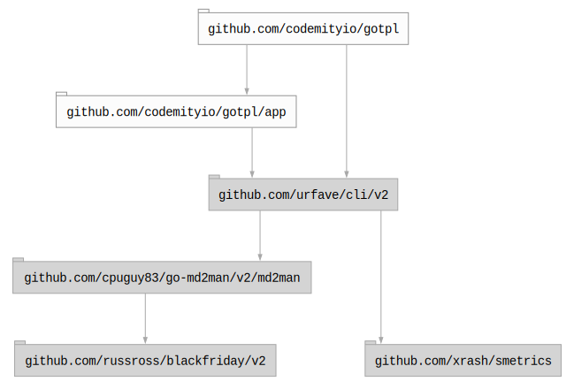

# 


## Table of contents

- [Summary](#summary)
- [Development](#development)
- [Installation](#installation)
- [Usage](#usage)
  - [Manual](#manual)
  - [Subcommands](#subcommands)
  - [Docker](#docker)
- [Packages](#packages)
- [Dependencies](#dependencies)
  - [Graph](#graph)
  - [Licenses](#licenses)
- [License](#license)

## Summary

Go project template.

## Development

To work with the codebase, use `make` command as the primary entry point for all project tools.

Use the arrow keys `↓ ↑ → ←` to navigate the options, and press `/` to toggle search.

## Installation

To install the tool use `make install` (directly from the repository clone) or use
`go install github.com/codemityio/gotpl@latest`.

## Usage

Once you have the tool installed, just use the `gotpl` command to get started.

### Manual

``` bash
$ gotpl --help
NAME:
   gotpl - A new cli application

USAGE:
   gotpl [global options] command [command options]

VERSION:
   latest

AUTHOR:
   codemityio

COMMANDS:
   help, h  Shows a list of commands or help for one command

GLOBAL OPTIONS:
   --help, -h     show help
   --version, -v  print the version

COPYRIGHT:
   codemityio
```

### Subcommands

### Docker

``` bash
$ docker run codemityio/gotpl
```

## Packages

## Dependencies

### Graph



### Licenses

| Package                                 | Licence                                                         | Type         |
|-----------------------------------------|-----------------------------------------------------------------|--------------|
| github.com/cpuguy83/go-md2man/v2/md2man | https://github.com/cpuguy83/go-md2man/blob/v2.0.7/LICENSE.md    | MIT          |
| github.com/russross/blackfriday/v2      | https://github.com/russross/blackfriday/blob/v2.1.0/LICENSE.txt | BSD-2-Clause |
| github.com/urfave/cli/v2                | https://github.com/urfave/cli/blob/v2.27.7/LICENSE              | MIT          |
| github.com/xrash/smetrics               | https://github.com/xrash/smetrics/blob/686a1a2994c1/LICENSE     | MIT          |

## License

This project is licensed under the <YOUR_LICENCE> License. See the [LICENSE](LICENSE) file for details.
